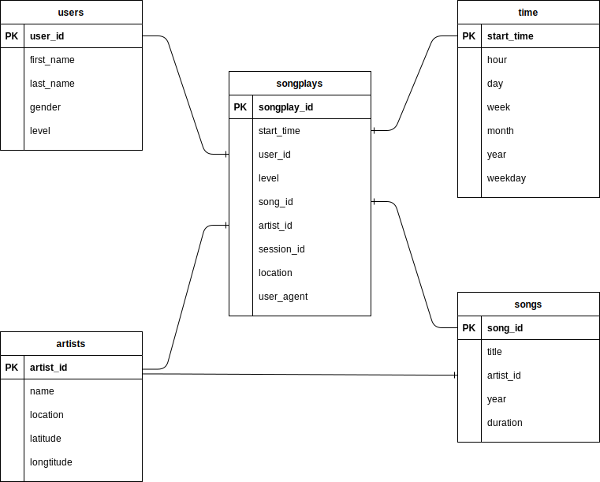
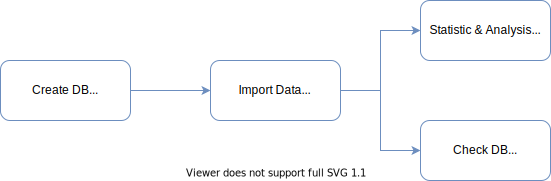

# Data Modeling with Postgres

## Introduction

A startup called Sparkify wants to analyze the data they’ve been collecting on songs and user activity on their new music streaming app. The analytics team is particularly interested in **understanding what songs users are listening to**.

Currently, they don’t have an easy way to query their data, which resides in a directory of JSON logs on user activity on the app and a directory with JSON metadata on the songs in their app. They’d like to **create a Postgres database with tables designed to optimize queries on song play analysis**.

In this project, I will:
- Create a star schema:  define fact and dimension tables for analytic focus.
- Write an ETL pipeline: transfer data from files in two local directories into tables in Postgres.
- Test the database and ETL pipeline.
- Do analyses on the song plays.

## Repo Structure

This repo consists of seven files and two directories:
1. `data` directory contains two sub-directories:
	- `song_data` is a subset of real data from the [Million Song Dataset](https://labrosa.ee.columbia.edu/millionsong/). Each file is in JSON format and contains metadata about a song and the artist of that song.
	- `log_data` consists of log files in JSON format generated by [event simulator](https://github.com/Interana/eventsim) simulating activity logs from Sparkify music streaming app.
2. `create_table.py` drops and creates the database `sparkifydb` with its tables. This file is used to reset the database before running ETL scripts.
3. `etl.py` reads and processes files from `data` directory and loads them into tables.
4. `sql_queries.py` contains all SQL queries and is imported to `create_table.py`, `etl.py`, and `etl.ipynb`.
5. `etl.ipynb` reads and processes a single file from `song_data` and `log_data` and loads the data into tables.
6. `test.ipynb` displays the first few rows of each table to check the database.
7. `dashboard.ipynb` generates statistics and analytic graphs on the database.
8. `images` directory contains all images generated from `dashboard.ipynb`
9. `README.md` (this file) gives a summary of the project and an explanation of designing the schema and programming. It also provides analyses on song plays.

## Designing Database

Designing the database `sparkifydb` in PostgreSQL, the Sparkify team has two objectives:
1. Load data from JSON files into tables to ease query data.
2. Tables designed to optimize queries on song play analysis.

Each file in `song_data` contains metadata about the song and artist of that song. This data, therefore, is stored in two separate tables:
- **artists** (artist_id, *name, location, latitude, longitude*): 
	- *artist_id* is the primary key of this table as it's unique to each artist.
	- Since the value of *artist_id* in JSON file is text, its data type is VARCHAR.
- **songs** (song_id, *artist_id, title, year, duration*):
	- *song_id* is the primary key as it's unique to each song.
	- *artist_id* is foreign key is to link to the table **artists**.

Each file in `log_data` contains data about the user and the song, the time, the location, the browser, etc., when he uses the app. This data, therefore, is stored in two separate tables:
- **users** (user_id, *first_name, last_name, gender, level*):
	- *user_id* is the primary key, it's unique to each user.
	- Since the value of *user_id* in JSON file is a number, its data type is INT
- **songplays** (songplay_id, *user_id, start_time, song_id, session_id, location, user_agent*):
	- *songplay_id* is the primary key. It doesn't exists in JSON file, so its data type is set to SERIAL to ease inserting data.
	- *user_id, song_id* are foreign keys to link to tables **users, songs**

This design of four tables satisfies 3NF, but it limits flexibility and doesn't optimize song play analysis queries.

For example, to answer the question *"which is the most favorite artist in the app?"* we need to join three tables **songplays, songs**, and **artists**. Another example, to answer *"which type of user is more active?"* we need to join two tables **songplays** and **users**.

Therefore, to optimize queries on song play analysis, we do denormalization.
- add two more columns *level* and *artist_id* to the table **songplays**.
- break down *start_time* into specific units: *day, month, year, hour, week, weekday*. They are stored in a new table **time** (start_time, *day, month, year, hour, week, weekday*).

Finally, we have a database schema optimized on queries on song play in the figure below.

<p align="center">

</p>

## Inserting Data

Since the data is loaded in from files, there may be a conflict at tables **users, songs, artists,** and **time** on its primary key if that user, song, artist, and time have been added earlier. We need, therefore, to set *do nothing* if having conflict when inserting data. For example,

```SQL
user_table_insert = ("""
INSERT INTO users(user_id, first_name, last_name, gender, level)
VALUES(%s, %s, %s, %s, %s)
ON CONFLICT(user_id)
DO NOTHING;
""")
```

The primary key of table **songplays** is an auto-increment field, so there's no conflict when inserting data. But I may have duplicate data. We need to remove duplicates when inserting data.

From my perspective, two records are duplicated if they have the same values in all fields except *songplay_id*.

```Python
# insert songplay records
songplay_data = list()
for index, row in df.iterrows():
	# get songid and artistid from song and artist tables
	cur.execute(song_select, (row.song, row.artist, row.length))
	results = cur.fetchone()

	if results:
		songid, artistid = results
	else:
		songid, artistid = None, None

	songplay_data.append((
		pd.to_datetime(row.ts, unit='ms'), row.userId,
		row.level, songid, artistid, row.sessionId,
		row.location, row.userAgent
	))
# remove duplicates
songplay_data = list(set(songplay_data))
cur.executemany(songplay_table_insert, songplay_data)
```

## How to run the Python scripts

The scripts will connect to PostgreSQL at the address `127.0.0.1` by using the username `student` and password `student`. The user `student` has to have permission to create a database. You also must have a database named `studentdb` on your system.

Following these steps below to test the program:

<p align="center">

</p>

1. Create the database `sparkifydb`: run the script `create_tables.py`.
Attention: This script will drop your database `sparkifydb` if it exists.
2. Import data from the directory `data` into the database:
	- Run the script `etl.py` if you want to load data from all JSON files into tables.
	- Run the notebook `etl.ipynb` if you want to load data from one JSON file in `song_data` and one JSON file in `log_data` into tables.
3. After creating the database and importing data, you're free to run notebooks:
	- The notebook `dashboard.ipynb` provides a general statistic on tables and gives some analytic graphs on song plays.
	- The notebook `test.ipynb` displays 5 rows of each table.