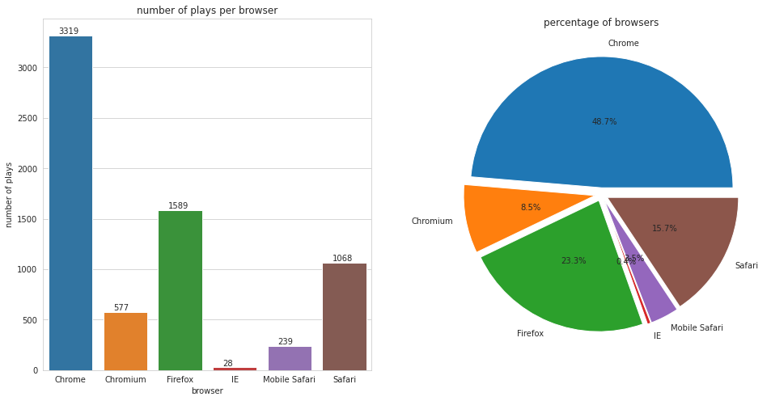
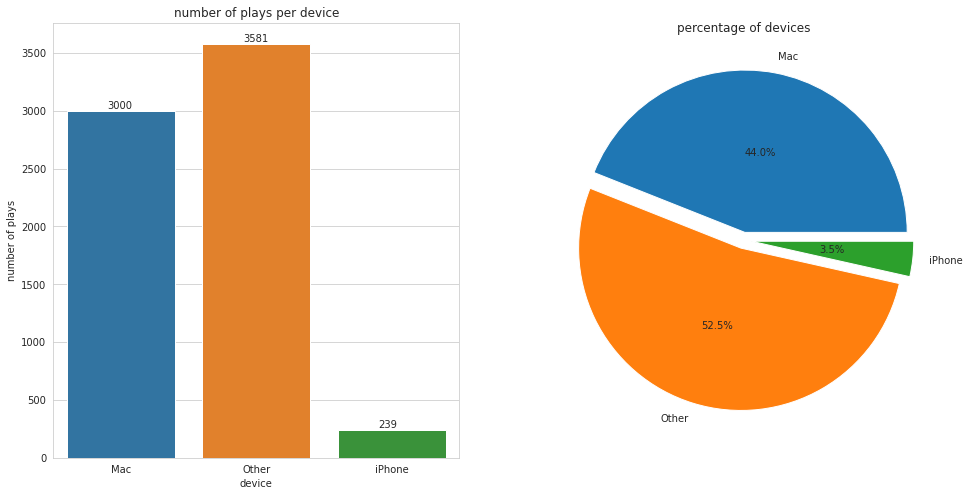
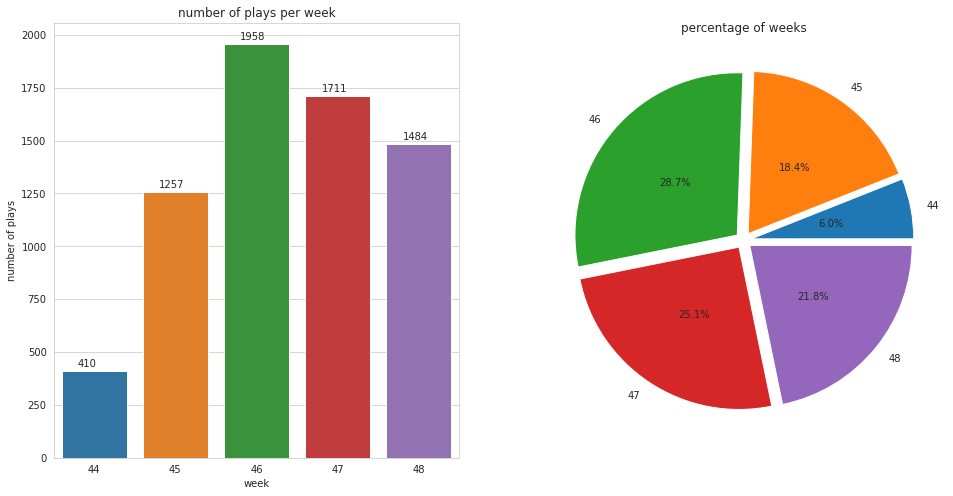

## 1. Import Python Libraries


```python
import psycopg2
import pandas as pd
import matplotlib.pyplot as plt
import seaborn as sns
import user_agents

%matplotlib inline
sns.set_style('whitegrid')
```

## 2. Connect Database


```python
conn = psycopg2.connect("host=127.0.0.1 dbname=sparkifydb user=student password=student")
cur = conn.cursor()
```

## 3. General Statistics


```python
def get_total(cur, tables):   
    totals = dict()
    for table in tables:
        query = "SELECT count(*) FROM %s;" % table
        cur.execute(query)
        res = cur.fetchone()
        totals[table] = res[0]
    return totals
```


```python
tables = ['songplays', 'users', 'artists', 'songs']
totals = get_total(cur, tables)
for k, v in totals.items():
    print("Total {} = {}".format(k, v))
```

    Total songplays = 6831
    Total users = 96
    Total artists = 69
    Total songs = 71


##### Display duplicates in songplays if it exists


```python
query="""
SELECT start_time, user_id, level, song_id, artist_id, session_id, location, user_agent
FROM songplays
GROUP BY start_time, user_id, level, song_id, artist_id, session_id, location, user_agent
HAVING count(*) > 1;
"""
cur.execute(query)
res_dup = cur.fetchall()
if res_dup:
    df_dup = pd.DataFrame(res_dup)
    df_dup.columns = ["start_time", "user_id", "level", "song_id", "artist_id", "session_id", "location", "user_agent"]
    display(df_dup.head())
```


<div>
<style scoped>
    .dataframe tbody tr th:only-of-type {
        vertical-align: middle;
    }

    .dataframe tbody tr th {
        vertical-align: top;
    }

    .dataframe thead th {
        text-align: right;
    }
</style>
<table border="1" class="dataframe">
  <thead>
    <tr style="text-align: right;">
      <th></th>
      <th>start_time</th>
      <th>user_id</th>
      <th>level</th>
      <th>song_id</th>
      <th>artist_id</th>
      <th>session_id</th>
      <th>location</th>
      <th>user_agent</th>
    </tr>
  </thead>
  <tbody>
    <tr>
      <th>0</th>
      <td>2018-11-01 21:08:16.796</td>
      <td>8</td>
      <td>free</td>
      <td>None</td>
      <td>None</td>
      <td>139</td>
      <td>Phoenix-Mesa-Scottsdale, AZ</td>
      <td>"Mozilla/5.0 (Windows NT 6.1; WOW64) AppleWebK...</td>
    </tr>
    <tr>
      <th>1</th>
      <td>2018-11-01 22:23:14.796</td>
      <td>101</td>
      <td>free</td>
      <td>None</td>
      <td>None</td>
      <td>100</td>
      <td>New Orleans-Metairie, LA</td>
      <td>"Mozilla/5.0 (Windows NT 6.3; WOW64) AppleWebK...</td>
    </tr>
    <tr>
      <th>2</th>
      <td>2018-11-01 21:24:53.796</td>
      <td>8</td>
      <td>free</td>
      <td>None</td>
      <td>None</td>
      <td>139</td>
      <td>Phoenix-Mesa-Scottsdale, AZ</td>
      <td>"Mozilla/5.0 (Windows NT 6.1; WOW64) AppleWebK...</td>
    </tr>
    <tr>
      <th>3</th>
      <td>2018-11-01 21:01:46.796</td>
      <td>8</td>
      <td>free</td>
      <td>None</td>
      <td>None</td>
      <td>139</td>
      <td>Phoenix-Mesa-Scottsdale, AZ</td>
      <td>"Mozilla/5.0 (Windows NT 6.1; WOW64) AppleWebK...</td>
    </tr>
    <tr>
      <th>4</th>
      <td>2018-11-01 21:28:54.796</td>
      <td>8</td>
      <td>free</td>
      <td>None</td>
      <td>None</td>
      <td>139</td>
      <td>Phoenix-Mesa-Scottsdale, AZ</td>
      <td>"Mozilla/5.0 (Windows NT 6.1; WOW64) AppleWebK...</td>
    </tr>
  </tbody>
</table>
</div>


##### Remove duplicates in songplays if it exists


```python
def remove_duplicates(cur, conn, df, df_index):
    """Summary
    - remove duplicates
    """

    select_query = """
SELECT songplay_id FROM songplays
WHERE (start_time = '%s') AND (user_id = %s) 
AND (level = '%s') AND (song_id = %s) 
AND (artist_id = %s) AND (session_id = %s)
AND (location = '%s') AND (user_agent = '%s')
ORDER BY songplay_id
"""

    query = select_query % tuple(df.iloc[df_index,:].to_list())
    query = query.replace('= None', 'IS NULL')

    cur.execute(query)
    res = cur.fetchall()
    # keep only the first one
    ids_deleting = [i[0] for i in res[1:]]

    if not ids_deleting: return 0
    del_query = "DELETE FROM songplays WHERE songplay_id IN (%s);" % ','.join(map(str, ids_deleting))
    cur.execute(del_query)
    rows_deleted = cur.rowcount
    conn.commit()
    
    return rows_deleted

if res_dup:
    rows_deleted = 0
    for i in range(df_dup.shape[0]):
        rd = remove_duplicates(cur, conn, df_dup, i)
        if rd: print('Removed %s duplicated rows' % rd)
        rows_deleted += rd
    print('Removed TOTAL %s duplicated rows' % rows_deleted)
```

    Removed 1 duplicated rows
    Removed 1 duplicated rows
    Removed 1 duplicated rows
    Removed 1 duplicated rows
    Removed 1 duplicated rows
    Removed 1 duplicated rows
    Removed 1 duplicated rows
    Removed 1 duplicated rows
    Removed 1 duplicated rows
    Removed 1 duplicated rows
    Removed 1 duplicated rows
    Removed TOTAL 11 duplicated rows


## 4. Analyses

### 4.1. Functions to plot


```python
def bar_plot(df, x, y, ix, iy, ax, **kwargs):
    sns.barplot(data=df, x=x, y=y, ax=ax);
    for p in ax.patches:
        ax.annotate('{}'.format(round(p.get_height())), (p.get_x() + ix, p.get_height() + iy))
    ax.set(**kwargs);

def pie_plot(df, x, y, ax, **kwargs):
    ax.pie(x=df[y], labels=df[x],
        autopct = "%.1f%%", explode = [0.05] * df.shape[0], pctdistance = 0.5
    );
    ax.set(**kwargs);

def plot_bar_pie_graphs(df, x, y, ix, iy, kwargs=[{}, {}], figsize=(16,8)):
    fig, axes = plt.subplots(1, 2, figsize = figsize)
    bar_plot(df, x, y, ix, iy, axes[0], **kwargs[0])
    pie_plot(df, x, y, axes[1], **kwargs[1])

def bar_plot_horizontal(df, x, y, ix, iy, ax, **kwargs):
    df[y] = df[y].astype(str)
    sns.barplot(data=df, x=x, y=y, ax=ax);
    for p in ax.patches:
        ax.annotate('{}'.format(round(p.get_width())), (p.get_width() + ix, p.get_y() + iy))
    ax.set(**kwargs);
```

### 4.2. Analyses on user level

##### Q1. Which user level is more active on Sparkify app?


```python
query="""
SELECT level, count(songplay_id)
FROM songplays
GROUP BY level;
"""
cur.execute(query)
res = cur.fetchall()
df_level = pd.DataFrame(res)
df_level.columns = ['level', 'plays']
df_level.head()
```


<div>
<style scoped>
    .dataframe tbody tr th:only-of-type {
        vertical-align: middle;
    }

    .dataframe tbody tr th {
        vertical-align: top;
    }

    .dataframe thead th {
        text-align: right;
    }
</style>
<table border="1" class="dataframe">
  <thead>
    <tr style="text-align: right;">
      <th></th>
      <th>level</th>
      <th>plays</th>
    </tr>
  </thead>
  <tbody>
    <tr>
      <th>0</th>
      <td>free</td>
      <td>1229</td>
    </tr>
    <tr>
      <th>1</th>
      <td>paid</td>
      <td>5591</td>
    </tr>
  </tbody>
</table>
</div>


```python
kwargs = [
    {'ylabel':'number of plays', 'title':'number of plays per level'},
    {'title':'percentage of plays per level'}
]
plot_bar_pie_graphs(df_level, 'level', 'plays', ix=0.35, iy=30, kwargs=kwargs)
plt.savefig('images/plays_per_level.png')
```


##### Q2. What is the rate of user levels?


```python
query="""
SELECT level, count(user_id)
FROM users
GROUP BY level;
"""
cur.execute(query)
res = cur.fetchall()
df_user = pd.DataFrame(res)
df_user.columns = ['level', 'users']
df_user.head()
```


<div>
<style scoped>
    .dataframe tbody tr th:only-of-type {
        vertical-align: middle;
    }

    .dataframe tbody tr th {
        vertical-align: top;
    }

    .dataframe thead th {
        text-align: right;
    }
</style>
<table border="1" class="dataframe">
  <thead>
    <tr style="text-align: right;">
      <th></th>
      <th>level</th>
      <th>users</th>
    </tr>
  </thead>
  <tbody>
    <tr>
      <th>0</th>
      <td>free</td>
      <td>74</td>
    </tr>
    <tr>
      <th>1</th>
      <td>paid</td>
      <td>22</td>
    </tr>
  </tbody>
</table>
</div>


```python
kwargs = [
    {'ylabel':'number of users', 'title':'number of users per level'},
    {'title':'percentage of users per level'}
]
plot_bar_pie_graphs(df_user, 'level', 'users', ix=0.36, iy=0.5, kwargs=kwargs)
plt.savefig('images/users_per_level.png')
```


### 4.3. Analyses on user agent


```python
query="""
SELECT user_agent, count(songplay_id)
FROM songplays
GROUP BY user_agent;
"""
cur.execute(query)
res = cur.fetchall()
df_user_agent = pd.DataFrame(res)
df_user_agent.columns = ['user_agent', 'plays']

ugs = [user_agents.parse(i) for i in df_user_agent['user_agent']]
df_user_agent['browser'] = [ug.browser.family for ug in ugs]
df_user_agent['os'] = [ug.os.family for ug in ugs]
df_user_agent['device'] = [ug.device.family for ug in ugs]
df_user_agent.head()
```


<div>
<style scoped>
    .dataframe tbody tr th:only-of-type {
        vertical-align: middle;
    }

    .dataframe tbody tr th {
        vertical-align: top;
    }

    .dataframe thead th {
        text-align: right;
    }
</style>
<table border="1" class="dataframe">
  <thead>
    <tr style="text-align: right;">
      <th></th>
      <th>user_agent</th>
      <th>plays</th>
      <th>browser</th>
      <th>os</th>
      <th>device</th>
    </tr>
  </thead>
  <tbody>
    <tr>
      <th>0</th>
      <td>"Mozilla/5.0 (Macintosh; Intel Mac OS X 10_9_4...</td>
      <td>111</td>
      <td>Chrome</td>
      <td>Mac OS X</td>
      <td>Mac</td>
    </tr>
    <tr>
      <th>1</th>
      <td>"Mozilla/5.0 (Windows NT 6.3; WOW64) AppleWebK...</td>
      <td>427</td>
      <td>Chrome</td>
      <td>Windows</td>
      <td>Other</td>
    </tr>
    <tr>
      <th>2</th>
      <td>Mozilla/5.0 (Windows NT 6.1; WOW64; rv:32.0) G...</td>
      <td>30</td>
      <td>Firefox</td>
      <td>Windows</td>
      <td>Other</td>
    </tr>
    <tr>
      <th>3</th>
      <td>Mozilla/5.0 (Windows NT 6.1; rv:31.0) Gecko/20...</td>
      <td>26</td>
      <td>Firefox</td>
      <td>Windows</td>
      <td>Other</td>
    </tr>
    <tr>
      <th>4</th>
      <td>"Mozilla/5.0 (X11; Linux x86_64) AppleWebKit/5...</td>
      <td>577</td>
      <td>Chromium</td>
      <td>Ubuntu</td>
      <td>Other</td>
    </tr>
  </tbody>
</table>
</div>


##### Q3. Which browsers are used to access Sparkify app?


```python
df_browser = df_user_agent[['browser', 'plays']].groupby(['browser']).sum().reset_index()
df_browser.head()
```


<div>
<style scoped>
    .dataframe tbody tr th:only-of-type {
        vertical-align: middle;
    }

    .dataframe tbody tr th {
        vertical-align: top;
    }

    .dataframe thead th {
        text-align: right;
    }
</style>
<table border="1" class="dataframe">
  <thead>
    <tr style="text-align: right;">
      <th></th>
      <th>browser</th>
      <th>plays</th>
    </tr>
  </thead>
  <tbody>
    <tr>
      <th>0</th>
      <td>Chrome</td>
      <td>3319</td>
    </tr>
    <tr>
      <th>1</th>
      <td>Chromium</td>
      <td>577</td>
    </tr>
    <tr>
      <th>2</th>
      <td>Firefox</td>
      <td>1589</td>
    </tr>
    <tr>
      <th>3</th>
      <td>IE</td>
      <td>28</td>
    </tr>
    <tr>
      <th>4</th>
      <td>Mobile Safari</td>
      <td>239</td>
    </tr>
  </tbody>
</table>
</div>


```python
kwargs = [
    {'ylabel':'number of plays', 'title':'number of plays per browser'},
    {'title':'percentage of browsers'}
]
plot_bar_pie_graphs(df_browser, 'browser', 'plays', ix=0.18, iy=15, kwargs=kwargs)
plt.savefig('images/browser.png')
```





##### Q4. Which OS are used to access Sparkify app?


```python
df_os = df_user_agent[['os', 'plays']].groupby(['os']).sum().reset_index()
df_os.head()
```


<div>
<style scoped>
    .dataframe tbody tr th:only-of-type {
        vertical-align: middle;
    }

    .dataframe tbody tr th {
        vertical-align: top;
    }

    .dataframe thead th {
        text-align: right;
    }
</style>
<table border="1" class="dataframe">
  <thead>
    <tr style="text-align: right;">
      <th></th>
      <th>os</th>
      <th>plays</th>
    </tr>
  </thead>
  <tbody>
    <tr>
      <th>0</th>
      <td>Linux</td>
      <td>576</td>
    </tr>
    <tr>
      <th>1</th>
      <td>Mac OS X</td>
      <td>3000</td>
    </tr>
    <tr>
      <th>2</th>
      <td>Ubuntu</td>
      <td>577</td>
    </tr>
    <tr>
      <th>3</th>
      <td>Windows</td>
      <td>2428</td>
    </tr>
    <tr>
      <th>4</th>
      <td>iOS</td>
      <td>239</td>
    </tr>
  </tbody>
</table>
</div>


```python
kwargs = [
    {'ylabel':'number of plays', 'title':'number of plays per OS', 'xlabel':'OS'},
    {'title':'percentage of OS'}
]
plot_bar_pie_graphs(df_os, 'os', 'plays', ix=0.2, iy=15, kwargs=kwargs)
plt.savefig('images/os.png')
```


##### Q5. Which devices are used to access Sparkify app?


```python
df_device = df_user_agent[['device', 'plays']].groupby(['device']).sum().reset_index()
df_device.head()
```


<div>
<style scoped>
    .dataframe tbody tr th:only-of-type {
        vertical-align: middle;
    }

    .dataframe tbody tr th {
        vertical-align: top;
    }

    .dataframe thead th {
        text-align: right;
    }
</style>
<table border="1" class="dataframe">
  <thead>
    <tr style="text-align: right;">
      <th></th>
      <th>device</th>
      <th>plays</th>
    </tr>
  </thead>
  <tbody>
    <tr>
      <th>0</th>
      <td>Mac</td>
      <td>3000</td>
    </tr>
    <tr>
      <th>1</th>
      <td>Other</td>
      <td>3581</td>
    </tr>
    <tr>
      <th>2</th>
      <td>iPhone</td>
      <td>239</td>
    </tr>
  </tbody>
</table>
</div>


```python
kwargs = [
    {'ylabel':'number of plays', 'title':'number of plays per device'},
    {'title':'percentage of devices'}
]
plot_bar_pie_graphs(df_device, 'device', 'plays', ix=0.3, iy=20, kwargs=kwargs)
plt.savefig('images/device.png')
```





### 4.4. Analyses on start time

##### Q6. What is the rate of using Sparkify app over weeks?


```python
query="""
SELECT week, count(songplay_id)
FROM songplays
JOIN time ON songplays.start_time = time.start_time
GROUP BY week
ORDER BY week;
"""
cur.execute(query)
res = cur.fetchall()
df_week = pd.DataFrame(res)
df_week.columns = ['week', 'plays']
df_week.head()
```


<div>
<style scoped>
    .dataframe tbody tr th:only-of-type {
        vertical-align: middle;
    }

    .dataframe tbody tr th {
        vertical-align: top;
    }

    .dataframe thead th {
        text-align: right;
    }
</style>
<table border="1" class="dataframe">
  <thead>
    <tr style="text-align: right;">
      <th></th>
      <th>week</th>
      <th>plays</th>
    </tr>
  </thead>
  <tbody>
    <tr>
      <th>0</th>
      <td>44</td>
      <td>410</td>
    </tr>
    <tr>
      <th>1</th>
      <td>45</td>
      <td>1257</td>
    </tr>
    <tr>
      <th>2</th>
      <td>46</td>
      <td>1958</td>
    </tr>
    <tr>
      <th>3</th>
      <td>47</td>
      <td>1711</td>
    </tr>
    <tr>
      <th>4</th>
      <td>48</td>
      <td>1484</td>
    </tr>
  </tbody>
</table>
</div>


```python
kwargs = [
    {'ylabel':'number of plays', 'title':'number of plays per week'},
    {'title':'percentage of weeks'}
]
plot_bar_pie_graphs(df_week, 'week', 'plays', ix=0.2, iy=20, kwargs=kwargs)
plt.savefig('images/week.png')
```





### 4.5. Analyses on location

##### Q7. What are top users, top regions using Sparkify app?


```python
query="""
SELECT user_id, count(songplay_id) AS plays
FROM songplays
GROUP BY user_id
ORDER BY plays DESC
LIMIT 10;
"""
cur.execute(query)
res = cur.fetchall()
df_user = pd.DataFrame(res)
df_user.columns = ['user', 'plays']
df_user.head()
```


<div>
<style scoped>
    .dataframe tbody tr th:only-of-type {
        vertical-align: middle;
    }

    .dataframe tbody tr th {
        vertical-align: top;
    }

    .dataframe thead th {
        text-align: right;
    }
</style>
<table border="1" class="dataframe">
  <thead>
    <tr style="text-align: right;">
      <th></th>
      <th>user</th>
      <th>plays</th>
    </tr>
  </thead>
  <tbody>
    <tr>
      <th>0</th>
      <td>49</td>
      <td>689</td>
    </tr>
    <tr>
      <th>1</th>
      <td>80</td>
      <td>665</td>
    </tr>
    <tr>
      <th>2</th>
      <td>97</td>
      <td>557</td>
    </tr>
    <tr>
      <th>3</th>
      <td>15</td>
      <td>463</td>
    </tr>
    <tr>
      <th>4</th>
      <td>44</td>
      <td>397</td>
    </tr>
  </tbody>
</table>
</div>


```python
query="""
SELECT REVERSE(TRIM(SPLIT_PART(REVERSE(location), ',', 1))) AS region, count(songplay_id) AS plays
FROM songplays
GROUP BY region
ORDER BY plays DESC
LIMIT 10;
"""
cur.execute(query)
res = cur.fetchall()
df_region = pd.DataFrame(res)
df_region.columns = ['region', 'plays']
df_region.head()
```


<div>
<style scoped>
    .dataframe tbody tr th:only-of-type {
        vertical-align: middle;
    }

    .dataframe tbody tr th {
        vertical-align: top;
    }

    .dataframe thead th {
        text-align: right;
    }
</style>
<table border="1" class="dataframe">
  <thead>
    <tr style="text-align: right;">
      <th></th>
      <th>region</th>
      <th>plays</th>
    </tr>
  </thead>
  <tbody>
    <tr>
      <th>0</th>
      <td>CA</td>
      <td>1572</td>
    </tr>
    <tr>
      <th>1</th>
      <td>ME</td>
      <td>665</td>
    </tr>
    <tr>
      <th>2</th>
      <td>MI</td>
      <td>636</td>
    </tr>
    <tr>
      <th>3</th>
      <td>IL-IN-WI</td>
      <td>475</td>
    </tr>
    <tr>
      <th>4</th>
      <td>GA</td>
      <td>456</td>
    </tr>
  </tbody>
</table>
</div>


```python
kwargs = [
    {'xlabel':'number of plays', 'title':'Top 10 users using Sparkify app', 'ylabel': 'user id'},
    {'xlabel':'number of plays', 'title':'Top 10 regions using Sparkify app'}
]
fig, axes = plt.subplots(1, 2, figsize=(16, 8))
bar_plot_horizontal(df_user, 'plays', 'user', ix=2, iy=0.5, ax=axes[0], **kwargs[0])
bar_plot_horizontal(df_region, 'plays', 'region', ix=2, iy=0.5, ax=axes[1], **kwargs[1])
plt.savefig('images/top_users_regions.png')
```


```python
cur.close()
conn.close()
```


```python

```
